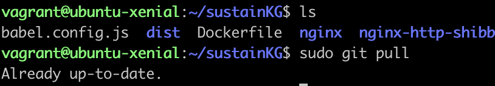

## Welcome to SustainKG Guide

This system aims to provide a tool for users to create their own concept map. This document can help you learn about the functions used in the system. The system is based on Apache Server and uses Shibboleth module for protecting the users' login information. Please remember to open the UCI VPN to use or develop SustainKG project.

The project urls are below:

[SustainKG Projects](https://github.com/greenguy33/sustainKG)

[Apache and Shibboleth Configuration](https://github.com/kobewilliam/Ubuntu-shibboleth)

### Installation of VUE-CLI

Please download Node.js and NPM first, the website is [here](https://nodejs.org/en/)

check the version of Node.js and NPM if download successfully

```

node -v

npm -v


```
Install VUE-CLI and check its version using the following commands:

```

npm install -g @vue/cli

vue --version

```
### Set Up Docker Container

For the SustainKG project, the docker container uses Ubuntu as the platform and Apache as the server. At the same time, it uses Shibboleth module to protect the users' login information. The details are [here](https://github.com/kobewilliam/Ubuntu-shibboleth):

### Update the certifications for the front End

Please go to the UCI server and do the following commands, then you will find the certifications used by the front end. You can update them.

```

cd Ubuntu-shibboleth

cd docker/ssl

```

### Configuration file

The configuration file is sustainKG/src/assets/config.js. The follow steps will illustarte how to modify the config file as your preference.

The first step is to learn about the config file sample.

```markdown 

let config = {


    admin_users : ['hfreedma', 'qingys1', 'wmt'],
    relationships : ["causes", "inhibits", "produces", "has part", "part of"],
    concepts : 'Wikipedia',
    Voting : true,
    Citations : true,
    Collaborative : true,
    useShibboleth : true,
    protocol: 'ws://localhost:8089/connectToWebsocket'

};

export { config }

admin_users : The user who has authority to check the dashboard. For example, if your username of UCI account is 'hfreedma' and you wish to check the dashboard, then you should add 'hfreedma' into the 'admin_users' like the above sample.

relationships : The user can change this paramter to modify the label selection of the links. For example, there are two concepts A and B, and A 'causes' B, we can see from the 'relationships', there is a selection called 'causes'. And if A 'is' B, but it doesn't contain 'is', then we can add 'is' to the 'relationships'. The next time you create a link, you can find a selection called 'is'.

'concepts' : The user can select the concept name from the Wikipedia search results. 

'Voting' : 

'Citations': If a citation will be added into the link. If it is true, we can't only select the label of the link but also input a citation of the link. 

'Collaborative' : If it is true, we will use the websockets to help users work in one graph together. 

'protocol' : This means the websocket request to the backend. 

```

After learning about the sample, the next step is to make the modification effective. 

1. Log in the UCI VPN
2. Log in the Vagrant machine (xenial_2)
3. Use the following commands:

```
cd sustainKG

sudo git pull 

sudo npm run build

```



After the success of building, you will get a folder called /dist, then copy the folder into the docker. 

```
cd ../Ubuntu-shibboleth

sudo cp -r ../sustainKG/dist docker/secure

```

Then, we can build the docker container. (Please pay attention to the period !!!)

```
sudo docker build -t ubuntu-shib .

```


Finally we can start the docker container! 

```

sudo docker run -itp 443:443 -e FQDN=graphdb.ics.uci.edu --net sustainKGnetwork --name ubuntu-shib ubuntu-shib


```


If you already start a container, please delete it first.

```

sudo docker rm -f ubuntu-shib

```

Now, please have fun about your modification!

### Functions

```markdown

#renderGraph()

"""

Input: Concept Map (json format [nodes:[...], links:[...]]) 
Usage: This functions read the json format data to show a concept map in the website canvas. 
       If you would like to learn more about the d3, please check the website of d3-force document.
       When modifications are made for the concept map, this function will be called to update the concept map.
"""


#doubleClick()

"""

Input: info, node, node_name, snippet
Usage: Users can double click the blanket part in the website to create a node and select its name.
       If the name has already existed, the node will not be created. 
       
"""

#submitData()

"""

Usage: Submit the data to the database as the json format.

"""

#mounted()

"""

Usage: Call the functions when the front-end server starts. 


"""

#Search()

"""

Usage: Search the node name from Wikipedia for users to select as the current node name

"""

#handleShow()

"""

Usage: After the user log in the system, it will get the data from the backend and show a concept map to users
       in the front end. 

"""

#selectClear()

"""

Usage: clear all the input variable value for the element.

"""

#change_node_name()

"""

Usage: Change the node name by right clicking the node

"""

#change_link_name()

"""

Usage: Change the link name by right clicking the link

"""

#drag_addLinks()

"""

Usage: Users can make a single click to a node and drag a link to another node to create a link. 

"""

#addVote()

"""

Usage: Users can vote the link to show if they like or dislike the relationship. And other users can see that. 

"""

#zoomed()

"""

Usage: Users can make the graph to zoom or shirnk by Sliding the mouse wheel. And after they log in again, the graph will be shown in the previous scale they set.

"""

#tick()

"""

Usage: Simulation of the graph which means keep the graph updating with every operations by users. 

"""

#transform1() & transform2()

"""

Usage: Initialize and update the nodes(transform1) and text(transform2) position. It also controls the movements of the nodes and text. 

"""

#getNodesLine()

"""

Usage: Initialize and update the links position, the links' postion are determined by the positions of the nodes. This function will calculate the correct straight line between the two nodes(source and target). 

"""

#getCircleColor()

"""

Usage: If we click a node which is not clicked before, the node will change the color from orange to red and we can add links by dragging. If the node is red and we click it, it will return to the orange and we can drag the node to move instead of creating links.

"""

#drag()

"""

Usage: this function has three stages: First, dragstart() which means the actions we can do before we drag the node, the second one is called drag() which means the actions we do during dragging, and the last one is dragend() which means the actions we do after dragging. Inside this function, a new line will show up during dragging to simulate the process of creating links if we click the node to make it color to be red. Everytime, we move the node, this movement will be saved automatically to the database. 

"""

#Menu()

"""

Usage: Control the menu style (The menu will show up when we right click the nodes or links) and also the vote function. 

"""


```

<!-- # Header 1
## Header 2
### Header 3

- Bulleted
- List

1. Numbered
2. List

**Bold** and _Italic_ and `Code` text -->

<!-- [Link](url) and  -->
<!-- For more details see [Basic writing and formatting syntax](https://docs.github.com/en/github/writing-on-github/getting-started-with-writing-and-formatting-on-github/basic-writing-and-formatting-syntax).

### Jekyll Themes

Your Pages site will use the layout and styles from the Jekyll theme you have selected in your [repository settings](https://github.com/kobewilliam/kobewilliam.github.io/settings/pages). The name of this theme is saved in the Jekyll `_config.yml` configuration file.

### Support or Contact

Having trouble with Pages? Check out our [documentation](https://docs.github.com/categories/github-pages-basics/) or [contact support](https://support.github.com/contact) and we’ll help you sort it out. -->
